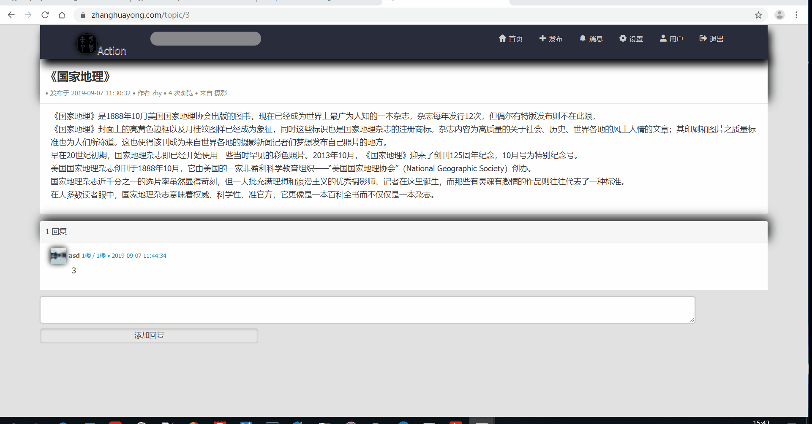

## 基于Flask的论坛

**主要功能**

- 用户登陆、个人主页、信息管理功能；

- 使用邮箱注册，使用注册邮箱找回密码。
 
- 话题的编辑、发布、评论，支持@用户功能；

- 邮件通知与系统消息通知功能，用户间支持私信功能，支持系统消息和私信的批量管理；**

**安全与优化**

- 实现对CSRF、XSS、SQL注入攻击的防御；

- 使用服务器端Session实现用户登录、登出；

- Session和页面Token使用redis进行存储，以支持多进程间数据共享；

- 变动频率较低的数据实现基于 Redis 的缓存优化，后续请求命中缓存时不需进行数据库操作，实现性能优化，减轻数据库访问压力。

**项目部署**

- 使用nginx 进行反向代理，过滤静态资源请求；
- 使用gunicorn多worker + gevent协程架构。

## 详细
###  注册和登陆

###  用户信息设置

###  发帖和评论

###  AT和站内私信

###  站内email

###  修改密码和登出

